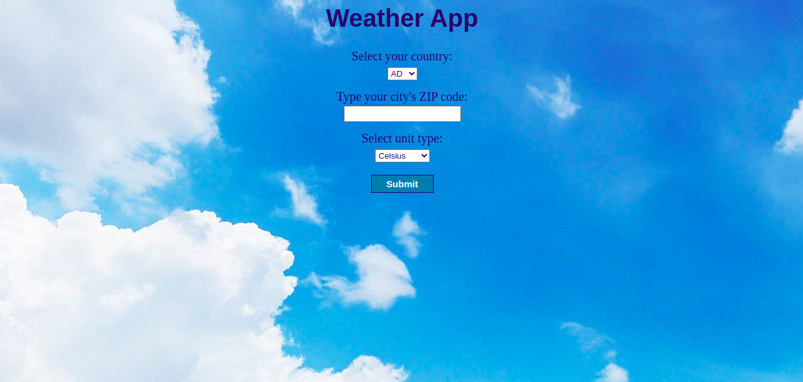

 

# Weather App

In this project I:

- Used Javascript to build a webpage using webpack and a [weather API](https://openweathermap.org/).

# What it does

- When the page loads, you can search for your city's ZIP code and it will show you the current weather.

## Built with

- Javascript
- HTML
- SCSS
- Webpack

## Live Demo

[Click here](https://rawcdn.githack.com/MuriloRoque/js_weather_app/db11615bcd1a1831b2f72862ab11c4dae12dbf9c/dist/index.html)

## Getting Started

- Clone the project to your local machine;
- `cd` into the project directory;
- Run `npm install` to install the necessary modules;
- Run `npm start`, the page will automatically load on [localhost:8080](localhost:8080).

## Author

Murilo Roque Paiva da Silva

Github: [@MuriloRoque](https://github.com/MuriloRoque)

Twitter: [@MuriloRoquePai1](https://twitter.com/MuriloRoquePai1)

Linkedin: [MuriloRoque](https://www.linkedin.com/in/murilo-roque-b1268741/)

## 🤝 Contributing

Contributions, issues and feature requests are welcome! Start by:

- Forking the project
- Cloning the project to your local machine
- `cd` into the project directory
- Run `git checkout -b your-branch-name`
- Make your contributions
- Push your branch up to your forked repository
- Open a Pull Request with a detailed description to the development branch of the original project for a review

## Show your support

Give a ⭐️ if you like this project!

## Acknowledgements

In this project, I used [OpenWeatherMap](https://openweathermap.org/)'s API.